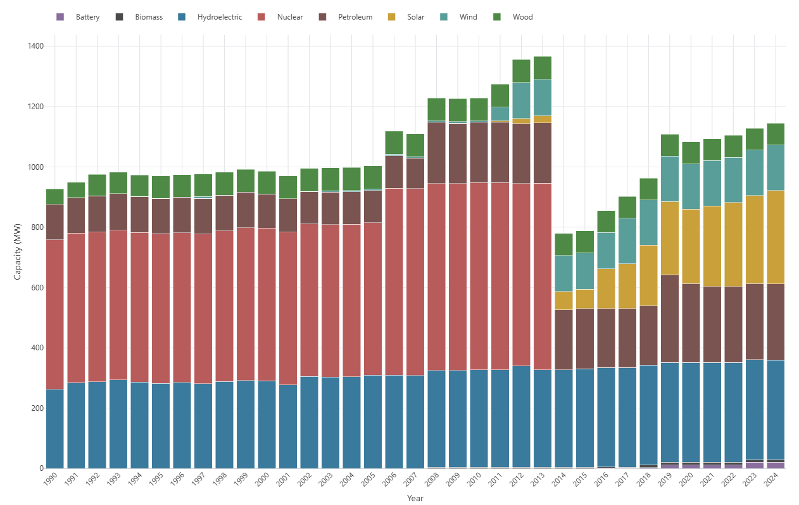
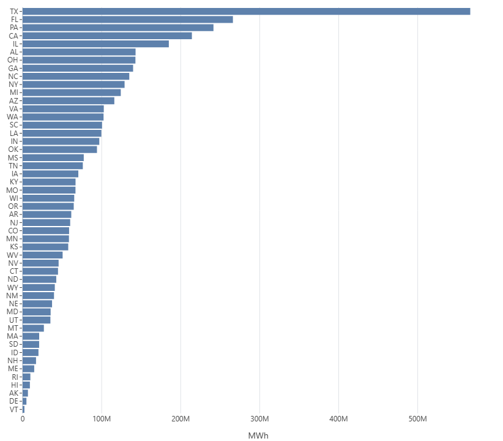

# EIA Data Tool

A small Flask app for exploring U.S. state-level electricity generation and trade data sourced 
from the [EIA Open Data API](https://www.eia.gov/opendata/).

This project is independent and not affiliated with the EIA.

## Features

- Annual electricity data for all 50 states + DC from 1990–2024
- Tracks net generation, interstate trade, and international imports/exports
- Charts for generation and trade trends over time
- Data cached locally in SQLite — only re-fetches from the API every 30 days

## Sample Charts

### Vermont Yearly Net Generation By Source


### 2024 Net Generation By State



## Setup
```bash
git clone https://github.com/jaketimm/EIA-Data-Tool.git
cd EIA-Data-Tool

python -m venv venv
source venv/bin/activate      # Windows: venv\Scripts\activate
pip install -r requirements.txt

python app.py
```

Then open http://127.0.0.1:5000 in your browser.

By default, the app includes a pre-built database so no API key is needed. Set `SKIP_FETCH = True` in `app.py`.

### Fetching fresh data (optional)

Register for a free EIA API key at [eia.gov/opendata](https://www.eia.gov/opendata/register.php), then create a `.env` file at the project root:
```
EIA_API_KEY="your_key_here"
```

Set `SKIP_FETCH = False` in `app.py` and restart.


### Project Structure
```
EIA-Data-Tool/
├── .env
├── requirements.txt
├── app.py
├── utils/
│   ├── __init__.py
│   ├── logger.py
│   ├── log_reader.py
│   ├── file_utils.py
│   ├── chart_formatters/
│   │   ├── generation_capacities.py
│   │   └── source_disposition.py
│   └── eia_api/
│       ├── fetch_yearly_generation_capacities_data.py
│       └── fetch_yearly_source_disposition_data.py
├── db/
│   ├── __init__.py
│   ├── eia.db
│   ├── connection.py
│   ├── source_disposition.py
│   └── generation_capacities.py
├── logs/
├── static/
│   ├── css/
│   └── js/
├── templates/
└── data/
```